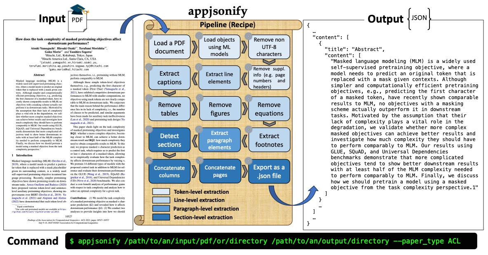

`appjsonify`: An Academic Paper PDF-to-JSON Conversion Toolkit
===

`appjsonify`[^1] is a handy PDF-to-JSON conversion tool for academic papers implemented in Python.
`appjsonify` allows you to obtain a structured JSON file that can be easily used for various downstream tasks such as paper recommendation, information extraction, and information retrieval from papers.  
[^1]: **A**cademic **P**aper **P**DF **jsonify**



## Requirements
* Linux or macOS (Not tested on Windows)
* Python 3.10 or later
* pdfplumber
* registrable
* tqdm
* pillow
* pdf2image
* torch
* **detectron2**
    > Please manually install it based on [the instructions](https://detectron2.readthedocs.io/en/latest/tutorials/install.html).


## Installation
#### Prerequisites
If your environment does not have `poppler`, please install it.
This is necessary to obtain PDF images using [`pdf2image`](https://github.com/Belval/pdf2image).
For more details, refer to [Prerequisites](./docs/prerequisites.md).

### Released version 
```bash
pip install appjsonify
python -m pip install 'git+https://github.com/facebookresearch/detectron2.git'
```

### Editable version (Beta)
```bash
git clone https://github.com/hitachi-nlp/appjsonify.git
python -m pip install --editable .
python -m pip install 'git+https://github.com/facebookresearch/detectron2.git'
```


## Usage
`appjsonify` offers two options to structure your paper PDF file into a JSON file.  
1. **Use the existing templates**  
Suitable if a paper adopts the `AAAI`, `ACL`, `ICML`, `ICLR`, `NeurIPS`, `IEEE`, `ACM`, or `Springer` styles. See [Templates](#templates) for more details.
2. **Configure pipelines and parameters by yourself**  
If a paper does not adopts the above formats, you need to specify the processing pipeline and its parameters. Please refer to [Build your own pipeline](#build-your-own-pipeline) for further information.


## Templates
`appjsonify` provides two types of the templates for each of the following paper types: `AAAI`, `ACL`, `ICML`, `ICLR`, `NeurIPS`, `IEEE`, `ACM`, and `Springer`.
One is more accurate but slower due to the use of machine learning based models, the other is less accurate but faster due to its rule based approach.

### AAAI papers
#### **Better performance but slower**
```bash
appjsonify /path/to/pdf/dir/or/path /path/to/output/dir --paper_type AAAI
```
> If your environment has a GPU(s), it is better to also specify `--detectron_device_mode cuda` to speed up the process.

#### **Faster but a bit noisy**
```bash
appjsonify /path/to/pdf/dir/or/path /path/to/output/dir --paper_type AAAI2
```

### ACL papers
#### **Better performance but slower**
```bash
appjsonify /path/to/pdf/dir/or/path /path/to/output/dir --paper_type ACL
```

#### **Faster but a bit noisy**
```bash
appjsonify /path/to/pdf/dir/or/path /path/to/output/dir --paper_type ACL2
```

### ICML papers
#### **Better performance but slower**
```bash
appjsonify /path/to/pdf/dir/or/path /path/to/output/dir --paper_type ICML
```

#### **Faster but a bit noisy**
```bash
appjsonify /path/to/pdf/dir/or/path /path/to/output/dir --paper_type ICML2
```

### ICLR papers
#### **Better performance but slower**
```bash
appjsonify /path/to/pdf/dir/or/path /path/to/output/dir --paper_type ICLR
```

#### **Faster but a bit noisy**
```bash
appjsonify /path/to/pdf/dir/or/path /path/to/output/dir --paper_type ICLR2
```

### NeurIPS papers
#### **Better performance but slower**
```bash
appjsonify /path/to/pdf/dir/or/path /path/to/output/dir --paper_type NeurIPS
```

#### **Faster but a bit noisy**
```bash
appjsonify /path/to/pdf/dir/or/path /path/to/output/dir --paper_type NeurIPS2
```

### IEEE papers
Currently only tested with IEEE BigData papers.

#### **Better performance but slower**
```bash
appjsonify /path/to/pdf/dir/or/path /path/to/output/dir --paper_type IEEE
```

#### **Faster but a bit noisy**
```bash
appjsonify /path/to/pdf/dir/or/path /path/to/output/dir --paper_type IEEE2
```

### ACM papers
Currently only tested with TALLIP papers.

#### **Better performance but slower**
```bash
appjsonify /path/to/pdf/dir/or/path /path/to/output/dir --paper_type ACM
```

#### **Faster but a bit noisy**
```bash
appjsonify /path/to/pdf/dir/or/path /path/to/output/dir --paper_type ACM2
```

### Springer papers
#### **Better performance but slower**
```bash
appjsonify /path/to/pdf/dir/or/path /path/to/output/dir --paper_type Springer
```

#### **Faster but a bit noisy**
```bash
appjsonify /path/to/pdf/dir/or/path /path/to/output/dir --paper_type Springer2
```

## Useful parameters
* `--verbose`: If you want to check the intermediate processing results, please set this flag. The log files will be saved under `output_dir`. Optionally, you can use the following four flags to add the corresponding information.  
    * `--show_pos`: Bounding box information.
    * `--show_font`: Font name and size information.
    * `--show_style`: Style information (e.g., `section`, `body`, `abstract`, etc.)
    * `--show_meta`: Supplementary information (e.g., information on objects and footnotes.)
    * `--insert_page_break`: Insert breaks between pages.
* `--save_image`: If you are using a more accurate but slower version of templates or `load_objects_with_ml`, `appjsonify` can save detected table and figure images if this flag is set. In addition to this, please also specify the output directory path as `--output_image_dir`.  


## Build your own pipeline
`appjsonify` also allows users to build their own academic paper PDF-to-JSON processing pipeline.
For more details, please refer to [Available Modules](./docs/modules.md) and [Document Handling in `appjsonify`](./docs/definition.md).


## How to add your own module
Users can add their own modules to `appjsonify` for more flexible document processing. 
To add modules, `appjsonify` must be installed in **editable** mode.
See [Customize `appjsonify`](./docs/customize.md) for more details and feel free to make a PR if you wish to add your module to this repository and package!


## Contributing and Future Work
Contributions are more than welcome! Feel free to raise an issue and/or make a PR.
Possible future work is as follows:  

* Better documentation
* More paper templates
* More robust references extraction
* Powerful mathematical equation support
* Robust algorithm description detection
* Multilingual support
* Add more test scripts


## Citation
If you use `appjsonify` in your work, please cite the following.
```
@article{yamaguchi2023appjsonify,
      title={appjsonify: An Academic Paper PDF-to-JSON Conversion Toolkit}, 
      author={Atsuki Yamaguchi and Terufumi Morishita},
      year={2023},
      eprint={2310.01206},
      archivePrefix={arXiv},
      primaryClass={cs.CL}
}
```

## License
© 2023 Atsuki Yamaguchi and Terufumi Morishita (Hitachi, Ltd.)  

This work is licensed under the MIT license unless specified.

`appjsonify` uses the follwoing publicly available works.  
* **pdfplumber** by Jeremy Singer-Vine ([MIT License](https://github.com/jsvine/pdfplumber/blob/stable/LICENSE.txt)).
* **registrable** by epwalsh ([Apache License 2.0](https://github.com/epwalsh/python-registrable/blob/master/LICENSE)).
* **tqdm** ([MIT License, Mozilla Public License 2.0 (MPL 2.0)](https://github.com/tqdm/tqdm/blob/master/LICENCE)).
* **pillow** by Jeffrey A. Clark ([Historical Permission Notice and Disclaimer License](https://github.com/python-pillow/Pillow/blob/main/LICENSE)).
* **pdf2image** by Edouard Belval ([MIT License](https://github.com/Belval/pdf2image/blob/master/LICENSE)).
* **torch** ([BSD-style license](https://github.com/pytorch/pytorch/blob/main/LICENSE)).
* **Detectron2** by Facebook AI Research ([Apache License 2.0](https://github.com/facebookresearch/detectron2/blob/main/LICENSE)) in [detectron2_demo](./appjsonify/modules/load/models/detectron2_demo).
* **DocBank** pretrained model by Microsoft Research Asia ([Apache License 2.0](https://github.com/doc-analysis/DocBank/blob/master/LICENSE)) in [docbank.py](./appjsonify/modules/load/models/docbank.py).
* **TableBank** pretrained model by Microsoft Research Asia ([Apache License 2.0](https://github.com/doc-analysis/TableBank/blob/master/LICENSE)) in [tablebank.py](./appjsonify/modules/load/models/tablebank.py).
* **PubLayNet** pretrained model by hpanwar08 ([Apache License 2.0](https://github.com/hpanwar08/detectron2/blob/master/LICENSE)) in [publaynet.py](./appjsonify/modules/load/models/publaynet.py).
